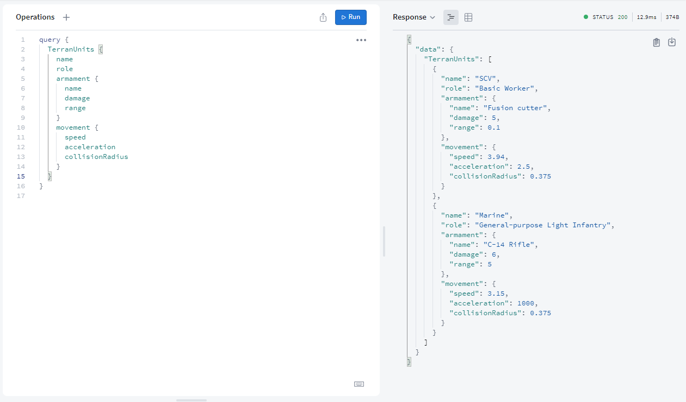

# 🚀 CCP2-API-Solo-Project

This was created during my time as a student at Code Chrysalis. It is an early implementation of an API that serves `StarCraft II ™` units and structures information. Powered by GraphQL and Prisma.

## 🔨 Repository Setup

- Clone or download this repository.
- Run `npm install` for installing the dependencies.
- Run `npm run prepare` for setting up `Husky`.

## 💾 Database Setup

We implemented our Database using `PostgreSQL`. Setting it up is beyond the scope of this project, so please refer the [Installation Guide](https://www.postgresql.org/download/) for your OS. Once you got it running, you can connect it to the project by following th steps in [this guide](https://www.prisma.io/docs/getting-started/setup-prisma/start-from-scratch/relational-databases-typescript-postgres).

We also have some hard-coded data and scripts prepared for getting you started:

- Run `npm run migrate` for applying the changes in your schema to the database.
- Run `npm run seed` for inserting the data from `./server/data` into your database.
- Run `npm run reset` for clearing all data and getting a fresh new database.

## 👨‍💻 Developer Tools

This project has some additional scripts for helping you during development:

- Run `npm run dev` for starting your server in development mode using `Nodemon`.
- Run `npm run start` for starting your server in production mode.
- Run `npm run lint` for applying `Prettier` format to your code.

You can check the behavior of your API in the `Apollo Studio Sandbox` after starting the server (follow the link in the terminal).

# 📚 References

- [StarCraft Wiki](https://starcraft.fandom.com/wiki/StarCraft_Wiki)
- [GraphQL Documentation](https://graphql.org/learn/)
- [Prisma Documentation](https://www.prisma.io/docs/concepts)
- [PostgreSQL Documentation](https://www.postgresql.org/docs/)

## 📝 License

> Check out the full license document [here](https://github.com/jean-fernandez-imt/CCP2-API-Solo-Project/blob/main/LICENSE).

This project is licensed under the terms of the MIT license.

